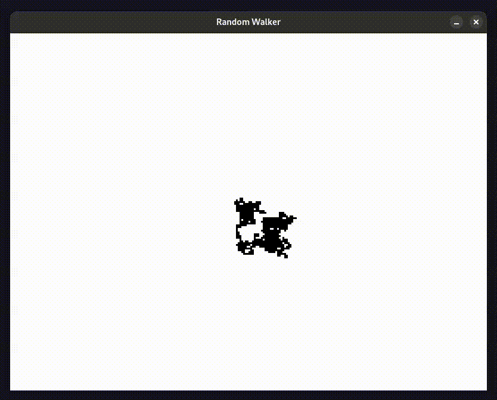

# Random Walker 

Simple project to test SDL3 / C / CMAKE.

## Build

Install `cmake` 3.30 or later from your Linux distribution and execute:

    $ cmake -DCMAKE_BUILD_TYPE=Release -B bin
    $ cmake --build bin

## Run

    $ ./bin/random_walker

